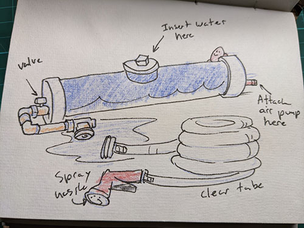
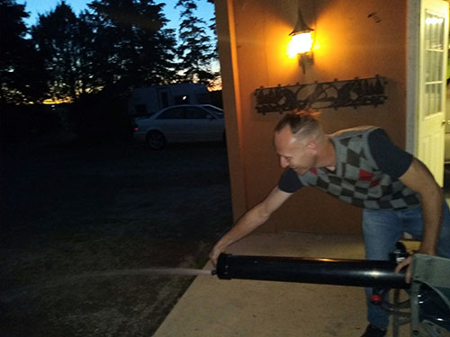
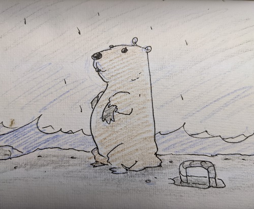
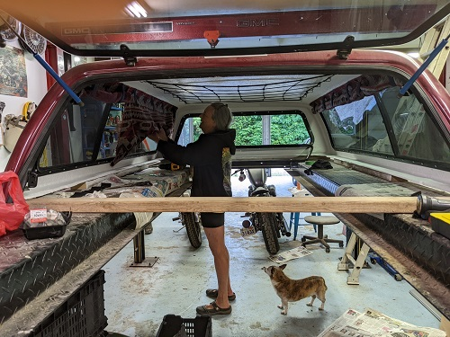

# Truck Trippo!
## Gitting rdy

Next week marks the start of my summer holidays! I’m planning on hitting the road in my truck where I’ve converted the back into a camper.  So I've started a blog on my Github hence the Gitting rdy in the title of this post. I've added the “po” to the end of “trip” to make Trippo, mostly because my truck reminds me of a hippo.  Depicted in the image below:

   

Nevertheless (is a neat word) I'm going to keep a daily journal of my travels. Check back for more posts about silly oberservations and doodles, maybe some pictures.  For now I will leave you with this piece of historical Canadian cinematography.

<a href="https://youtu.be/0p8oeiVDcx4" target="_blank">The Littlest Hobo Intro</a>  

 

<h2>Water Bazooka! or portable camping shower</h2>  
  2022-06-04  

So I made the ultimate Supersoaker water bazooka!  That can also be used as a portable water tank for washing stuff.. like muddy shoes, the truck, if you're brave you could use it as a shower.. you could even water plants! Anyways, it was pretty cool to see it work, Here is a picture of the initial test:

 

I've never experimented with plumbing, it was fun sticking little tubes together.  The dude at the plumbing store was super helpful with my wack McGuyver water tank.  Kudos to that dude.  Next up I'm finishing up the truck box cap, hopefully tomorrow I can get it put back together.  

  
<h2>Rainy Groundhog Sunday</h2>  
  2022-06-05  

Well, today was one of those rainy groundhog Sundays.  I just kept thinking about lost loves.  It’s hard to stay positive sometimes, everything has shifted so much and I can’t help but blame myself.   
 
I decided to go for a run to let go of some frustrations; I find running is almost meditative now.  I closed my eyes for a couple minutes after the run and focused on catching my breath.  When I opened then there was a ground hog standing up on the break wall by the water.  Nature always seems to happen when there is silence. 

<h2>Custom Curtains!</h2>  
  2022-06-06  

My holidays have officially started and my glamping outfit for my truck is nearly complete! Almost on schedule.  Well the nice part about traveling this way is that there is no schedule.   
   
I started work back in January on this project, pulling together camping gear and sketching out plans.. Most of which did not get built but it was fun to draw them up.  My laptop died randomly two nights ago so they might be lost in the abyss of the computer forever.  
   
Although, I did manage to really clean up my truck cap.  It was way more work than I anticipated.. it was so leaky, the fiberglass was old and mold, Rusty everything.. bugs.. all the bad camping stuff.  After many trips to the hardware store and a lot of late nights in the shop it almost done!  Here is a picture of my mom putting in the custom curtains, we had a great time picking the fabric out at the fabric store.  

 

Tomorrow I might ba able to get this cap back on my truck and hit the road.. where I'll go I don't know, probably north.

