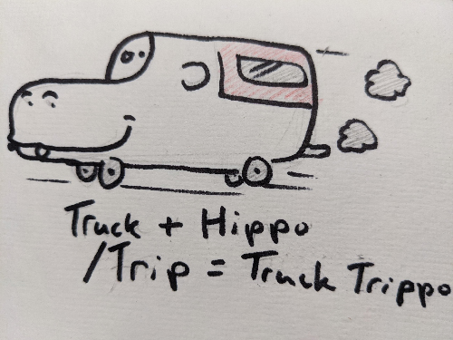

# Truck Trippo!
## Gitting rdy

Next week marks the start of my summer holidays! I’m planning on hitting the road in my truck where I’ve converted the back into a camper.  So I've started a blog on my Github hence the Gitting rdy in the title of this post. I've added the “po” to the end of “trip” to make Trippo, mostly because my truck reminds me of a hippo.  Depicted in the image below:

   

Nevertheless (is a neat word) I'm going to keep a daily journal of my travels. Check back for more posts about silly oberservations and doodles, maybe some pictures.  For now I will leave you with this piece of historical Canadian cinematography.

<a href="https://youtu.be/0p8oeiVDcx4" target="_blank">The Littlest Hobo Intro</a>  

 
## Water Bazooka!.. or portable shower
  
