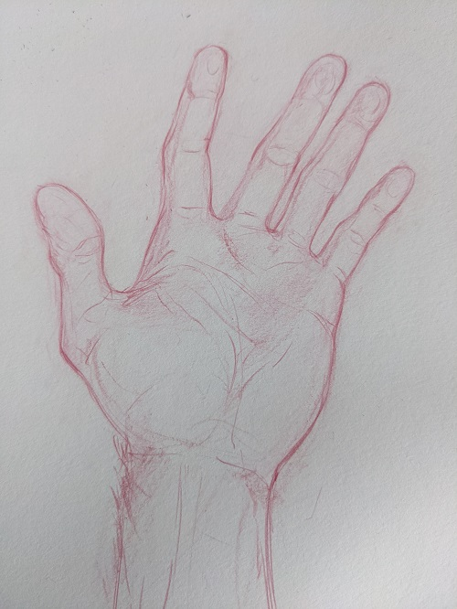
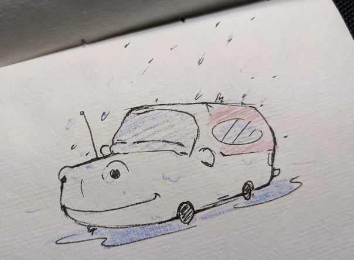
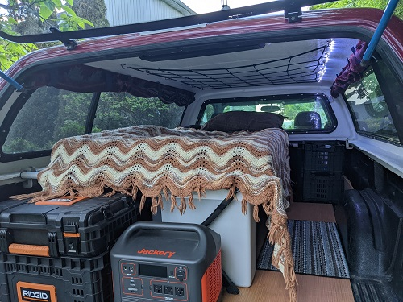

# Truck Trippo!
## Gitting rdy

Next week marks the start of my summer holidays! I’m planning on hitting the road in my truck where I’ve converted the back into a camper.  So I've started a blog on my Github hence the Gitting rdy in the title of this post. I've added the “po” to the end of “trip” to make Trippo, mostly because my truck reminds me of a hippo.  Depicted in the image below:

   

Nevertheless (is a neat word) I'm going to keep a daily journal of my travels. Check back for more posts about silly oberservations and doodles, maybe some pictures.  For now I will leave you with this piece of historical Canadian cinematography.

<a href="https://youtu.be/0p8oeiVDcx4" target="_blank">The Littlest Hobo Intro</a>  

 

<h2>Water Bazooka! or portable camping shower</h2>  
  2022-06-04  

So I made the ultimate Supersoaker water bazooka!  That can also be used as a portable water tank for washing stuff.. like muddy shoes, the truck, if you're brave you could use it as a shower.. you could even water plants! Anyways, it was pretty cool to see it work, Here is a picture of the initial test:

 

I've never experimented with plumbing, it was fun sticking little tubes together.  The dude at the plumbing store was super helpful with my wack McGuyver water tank.  Kudos to that dude.  Next up I'm finishing up the truck box cap, hopefully tomorrow I can get it put back together.  

  
<h2>Rainy Groundhog Sunday</h2>  
  2022-06-05  

Well, today was one of those rainy groundhog Sundays.  I just kept thinking about lost loves.  It’s hard to stay positive sometimes, everything has shifted so much and I can’t help but blame myself.   
 
I decided to go for a run to let go of some frustrations; I find running is almost meditative now.  I closed my eyes for a couple minutes after the run and focused on catching my breath.  When I opened then there was a ground hog standing up on the break wall by the water.  Nature always seems to happen when there is silence. 

<h2>Custom Curtains!</h2>  
  2022-06-06  

My holidays have officially started and my glamping outfit for my truck is nearly complete! Almost on schedule.  Well the nice part about traveling this way is that there is no schedule.   
   
I started work back in January on this project, pulling together camping gear and sketching out plans.. Most of which did not get built but it was fun to draw them up.  My laptop died randomly two nights ago so they might be lost in the abyss of the computer forever.  
   
Although, I did manage to really clean up my truck cap.  It was way more work than I anticipated.. it was so leaky, the fiberglass was old and mold, Rusty everything.. bugs.. all the bad camping stuff.  After many trips to the hardware store and a lot of late nights in the shop its almost done!  Here is a picture of my mom putting in the custom curtains, we had a great time picking the fabric out at the fabric store.  

 

Tomorrow I might ba able to get this cap back on my truck and hit the road.. where I'll go I don't know, probably north and see where the road takes me.

<h2>HighFive!</h2>  
  2022-06-07  

Another rainy day but it looks like the sun is breaking through.  Tomorrow is supposed to be nice and planning on finally getting my camp set up together.  I’ve been camping out once a week since February, I only missed a couple weeks because my truck was in the shop getting the breaks repaired.  Why? You may ask...  I guess for the most part just because the commute is bonkers to work and staying over broke up the week a bit.  But also in preparation for a road trip.  I wanted to make sure that I wouldn’t be out of luck on the road.. Wow, there was some out of luck on the road already.. glad I was close to home.  
 
The starter and my battery died one February night.. Glad I had my portable battery pack and heat blanket. Only negative 20… walk in the park. 
 
The breaks completely exploded haha.. I just made it to the shop.  Driving a big old truck with no breaks is a bit wacky. 
 
One time I’ll never forget, I had some company from a friend for part of it. I guess luck was on my side there. 
 
It was actually fun breaking out of the normal and acting like a hobo, something to look forward to or prepare for.
 
Well I’ll leave you with this sketch of my hand. Sometimes I get all existential crisis mode and start looking at my hands (Please don’t judge) Well this time I drew one of them.  Maybe I’ll keep doing it over my holidays. I could use the life drawing, it always seems to defragment the mind. 

<h2>Hippo truck likes the rain</h2>  
  2022-06-08  

The cap is on the truck! Thank-you to my friend Bryan, my Bro and Dad for moving that heavy thing.  We only almost dropped the cap once haha, glad I was in the middle like Quasimodo holding it up.. my back is fine.  
 
It’s a rainy night tonight so it will be a good test to see if its water proof.  It was not water proof before. I think it was wetter inside then outside.  Is “wetter” a word? I’ve never used it before.  Fingers crossed its nice and dry and good thing hippo truck likes the rain. 
 
Thurdays morning update -- extra dry under the cap woohoo!

<h2>Adventure time is near..</h2>  
  2022-06-09  

I’m excited, nervous and in a way questioning “why” I’m doing this in the first place.  It has always been a dream of mine to travel across Canada.  One summer I took the train out to Halifax in the hopes to travel all the way to BC.  Due to zero planning I just ended up staying in Halifax for a while and going to Montreal for a week or two. Anyways, it was an awesome experience and I met so many people.  That trip was more of an escape for me, I wanted to see some of the world and be Independent.  
 
This trip is different, I’m not trying to escape and being Independent is normal for me.  I started thinking about this trip probably close to a year ago, I was seeing a women that was moving out west and I thought it would be great to truck across and go too.  The distance was hard and as time moved on, so did we.  Part of me still wants to make it out to BC and see her again, but those are some far out dreams.
 
Although, I still kept dreaming about the trip and wondering, why? Is this for the experience, the memories? That would make this for myself.  I want to make the trip more, something I can share with people and possibly help people who want to travel across Canada too.  Or maybe just read about it and have a good time.  Anyways, that’s why I started a blog  
 
I should probably just stop thinking about it so much and just do it, see where the road takes me.  Without a knowing exactly where I’m going, it will be hard to take the wrong road.  It’s like real life haha.
 
I managed to get my gear all back together today before the thunder rolled in and tested it out.  Check it out! I’m pretty proud of my little truck camping setup. 

